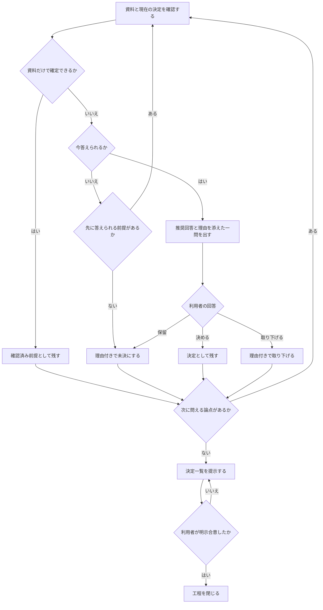
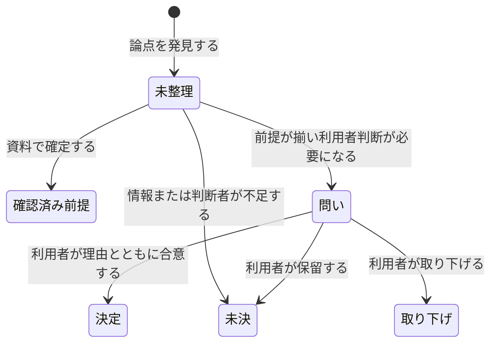
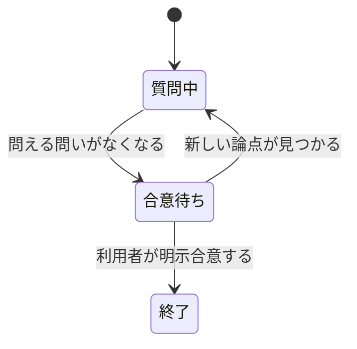

# 問いと合意形成 — 業務知識と振る舞い

## この資料の位置付け

この資料は、資料から確定できない曖昧さを一つずつ問いへ変え、利用者の回答を決定状態として残し、明示合意によって工程を閉じる判断を定める正本である。

> コアは、事実を先に確かめ、今答えられる曖昧さだけを推奨付きの一問として提示し、利用者の明示合意まで決定状態を追う判断である。

質問画面、保存形式、コマンド、設定解決、ファイル更新手順は実現手段であり、この資料の対象外とする。

## 根拠と確からしさ

この資料で従来から定めていた問い方の判断指針と、[合意までの進行](workflow.md)で観測できる規則を、確認済みの業務理解として扱う。

## コアの境界

| 区分 | 対象 |
|---|---|
| コア | 問う必要性、問いの順序、推奨回答、回答の状態、明示合意による終了判断 |
| 支援 | 決定記録の整形、決定一覧の提示 |
| 汎用 | 設定読込、形式検査、ファイル保存 |

## ユビキタス言語

| 用語 | 意味 |
|---|---|
| 論点 | 決定、未決、取り下げのいずれかへ整理すべき曖昧さ |
| 問い | 資料では確定できず、前提が揃い、利用者の判断を必要とする論点を一件だけ提示したもの |
| 推奨回答 | 利用者が確認または修正できるよう、確認済み根拠とともに先頭へ置く提案 |
| 決定 | 利用者が合意した内容と、その場で述べた理由を記録した状態 |
| 未決 | 情報、判断者、または試行が不足し、決められない理由を残した状態 |
| 取り下げ | 取り下げた理由を残し、同じ論点の再発を防ぐ状態 |
| 明示合意 | 決定・未決・取り下げの一覧を見た利用者が、工程を閉じることへ同意した事実 |

## アクターと協働

| アクター | 目的 | 担う判断 |
|---|---|---|
| 利用者 | 調査では確定できない決定を確認または修正し、決定一覧へ合意する | 回答と工程終了の明示合意 |
| 問い手 | 事実を先に調べ、今問える一問を推奨と理由付きで提示する | 問う必要性、問いの順序、回答状態の記録 |

## 全体の流れ



## 状態と業務イベント





## 問い方の規律

何を先に問うか・何を問わずに調べるか・どこで止めるかは、設定では決まらない。

## なぜ1問ずつなのか

**まとめて問うと、人は答えやすいものから答える。** 5問並べると、難しい1問が黙って落ちる。落ちたことに問うた側も気づかない。

**1問ずつ出して、答えを待ってから次へ進む。** 前の答えで次の問いが変わることも多い。まとめて出した時点で、その依存が見えなくなっている。

## 推奨回答を必ず添える

**丸投げの質問をしない。** 「どうしますか？」は、考える仕事をそのまま相手へ渡している。

```
❓ **<問いの題名>**: <本文。閉じた選択肢なら選択式で、推奨を先頭に置く>

➡️ 推奨: <推奨する答え>
   理由: <その場で述べられる根拠>
```

**推奨があれば、相手は確認か修正だけで前へ進める。** ゼロから考えさせない。

**この形は、丸投げを自分で見つけるためにある。** 推奨のない問いは `➡️` 行が無いので一目で分かる。問いの数も観点の網羅率も数えないが、1問ずつの形は崩れたときに見える。

**推奨が問いの前提を否定する形になったら、問いを立て直してから出す。** 「Aにしますか？」に「いいえ、Bを推奨します」と続けると、推奨に同意する人は問いにはNoと答えることになる。誰が何に同意したのか、後から読めなくなる。

## 事実は自分で調べる、決定は相手に返す

**問いにする前に調べる。** コード・既存文書・履歴に答えがあるなら、それは質問ではなく怠慢である。

調べて分かったら、**「この前提でいく」と宣言して次へ進む**。宣言することが大事で、黙って前提にすると、間違っていたときに誰も気づけない。

**決定は相手のものである。** 事実を埋める仕事をこちらが引き受けるのは、決定だけを相手に残すためであって、決定まで引き受けるためではない。

**自分の問いに自分で答えて先へ進んだ実行は、解釈の幅ではなく壊れている。** 特に別の工程から呼ばれたときに起きる。周りのタスクが進行中であることは、決定を代行してよい理由にならない。

## 問える問いから問う

**上流から固める。** スコープが決まらないうちに境界値を問うても、スコープが変われば全部やり直しになる。

**いま問えるのは、前提がすべて決まっている論点だけである。** まだ答えの出ていない問いに依存する問いは、いま出しても推測で答えさせることになる。後回しにする。

**ある問いの答えが別の問いを消すなら、消すほうを先に問う。**

どれが問えるかは判断であって計算ではない。順番を誤ったと気づいたら、その枝へ戻って問い直す。

## 業務の言葉で問う

**関数名・テーブル名・RPC 名で問わない。** 答える人がその語を使っていないなら、翻訳の手間を相手に負わせている。

## どこで止めるか

**曖昧さが残っていても、決められないものは決められない。** 情報が足りない・判断者が不在なら、**未決として残す**のが正しい。

無理に決めさせると、後で覆る決定が決定ログに残る。**「未決」と書いてあるほうが、間違った決定より役に立つ。**

**会話では決まらない問いがある。** 見た目・体感・使い勝手など、試して初めて答えられるものは、言い換えを重ねても近づかない。言い換え続けると、相手は推測で答え、その不確かさを埋めるためにスコープが膨らむ。**未決として残し、「何を試せば決まるか」を理由に書いて次へ進む。**

**問いが異常に長く続くなら、それはスコープが大きすぎるサインである。** 問いの数に上限は置かない。上限は、難しい題材を途中で切り、易しい題材では意味を持たない。代わりに、題材を分けてから詰め直す。

## 決定ログに何を書くか

**何を決めたかと、なぜそう決めたか。** 理由の無い決定は、後から読んだ人が覆せない（覆していいのかも分からない）。

**その場で述べられていない理由を補わない。** 推測した理由は、後から事実として読まれる。

## やらないこと

- **一度に大量の問いを浴びせる**（1問ずつ・答えを待つ）
- **推奨回答なしの丸投げ**
- 答えが手元にあるのに人に聞く
- **自分の問いに自分で答えて先へ進む**
- **この工程で実装や資料作成まで進める**（詰めるだけ。着地は別の工程）
- 決まっていないことを決まったように書く

## 業務ルール

1. 調査で確定できる事実は質問にせず、確認済み前提として示す。
2. 一度に提示するのは、前提が揃った一問だけである。
3. 各質問には推奨回答と、確認済みの理由を添える。
4. 決められない論点は推測で決定せず、何が分かれば決まるかを理由に未決として残す。
5. 問える問いがなくなっても、利用者の明示合意までは工程を完了しない。
6. 決定は、利用者が合意した内容とその場で述べた理由が揃ったときだけ記録する。理由を後から推測で補わない。
7. 前提に未決の論点がある問いは提示せず、先に答えられる論点へ進む。

## 代表BDD

Feature: 確認済みの事実から一問ずつ合意を形成する

```gherkin
Scenario: 資料で確定できる事実は質問しない
  Given 論点L1の答えが既存資料に記録されている
  And 問い手が既存資料の該当記述を確認している
  When 問い手が次に提示する問いを選ぶ
  Then 論点L1は利用者への問いにならない
  And 確認した内容が前提として示される
```

```gherkin
Scenario: 判断者が不在の論点を未決として残す
  Given 論点L1は既存資料だけでは確定できない
  And 論点L1を決める判断者を特定できる
  When 論点L1の判断者が不在だと確認される
  Then 論点L1は未決になる
  And 判断者が不在であることが理由として残る
```

```gherkin
Scenario: 明示合意がないときは工程を閉じない
  Given 今答えられる問いが残っていない
  And 決定・未決・取り下げの一覧が利用者へ提示されている
  And 利用者が工程終了へ明示合意していない
  When 問い手が合意形成の工程を閉じようとする
  Then 合意形成の工程は終了しない
NOTE:
  Rule: 明示合意までは工程を完了しない
  Reason: 工程を閉じる必要条件である利用者の明示合意がないため
```

```gherkin
Scenario: 推奨回答のない問いは提示しない
  Given 論点L1の前提はすべて決まっている
  And 論点L1に確認済みの理由が添えられている
  And 論点L1に推奨回答が添えられていない
  When 問い手が論点L1を利用者へ提示しようとする
  Then 論点L1は利用者へ提示されない
NOTE:
  Rule: 各質問に推奨回答と理由を添える
  Reason: 利用者が確認または修正だけで進めるための推奨回答がないため
```

```gherkin
Scenario: 前提が揃っていない論点は後に回す
  Given 論点L1は既存資料だけでは確定できない
  And 論点L1の前提に未決の論点L0がある
  And 論点L0は今答えられる
  When 問い手が論点L1を次の問いに選ぼうとする
  Then 論点L1は次の問いにならない
  And 問い手は論点L0を先に扱う
NOTE:
  Rule: 前提が揃った問いだけを提示する
  Reason: 論点L0が決まる前は論点L1へ意味のある回答ができないため
```

```gherkin
Scenario: 複数の論点から一問だけを提示する
  Given 論点L1は今答えられる
  And 論点L2も今答えられる
  When 問い手が次の問いを提示する
  Then 利用者へ提示される問いは一件だけである
  And 二件の問いが同時には提示されない
```

```gherkin
Scenario: 利用者の明示合意で工程を閉じる
  Given 決定・未決・取り下げの一覧が利用者へ提示されている
  And 今答えられる問いが残っていない
  When 利用者が決定一覧と工程終了へ明示合意する
  Then 合意形成の工程は終了する
```

```gherkin
Scenario: 理由のない決定を記録しない
  Given 利用者は論点L1の回答へ合意している
  And 利用者は論点L1の決定理由を述べていない
  And 論点L1は問いの状態である
  When 問い手が論点L1の決定を記録しようとする
  Then 論点L1の決定は記録されない
  And 論点L1は問いの状態のまま変わらない
NOTE:
  Rule: 内容と理由が揃った決定だけを記録する
  Reason: 確認されていない理由を利用者の判断根拠として残せないため
```

## 未回答の問い

- 複数の判断者が同じ論点へ異なる回答をした場合の優先規則は、既存資料だけでは確認できない。
- 明示合意後に前提が変わった場合、同じ工程を再開するか新しい工程にするかは未確認である。

## この資料に書かないもの

- 質問画面や選択肢の表示方法
- コマンド、スクリプト、設定ファイル、保存形式
- 決定記録を保存するファイル名やディレクトリ
- 題材固有の業務判断
